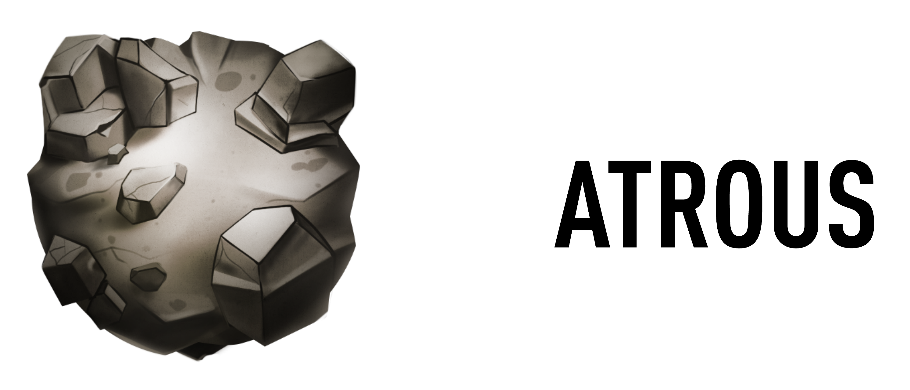
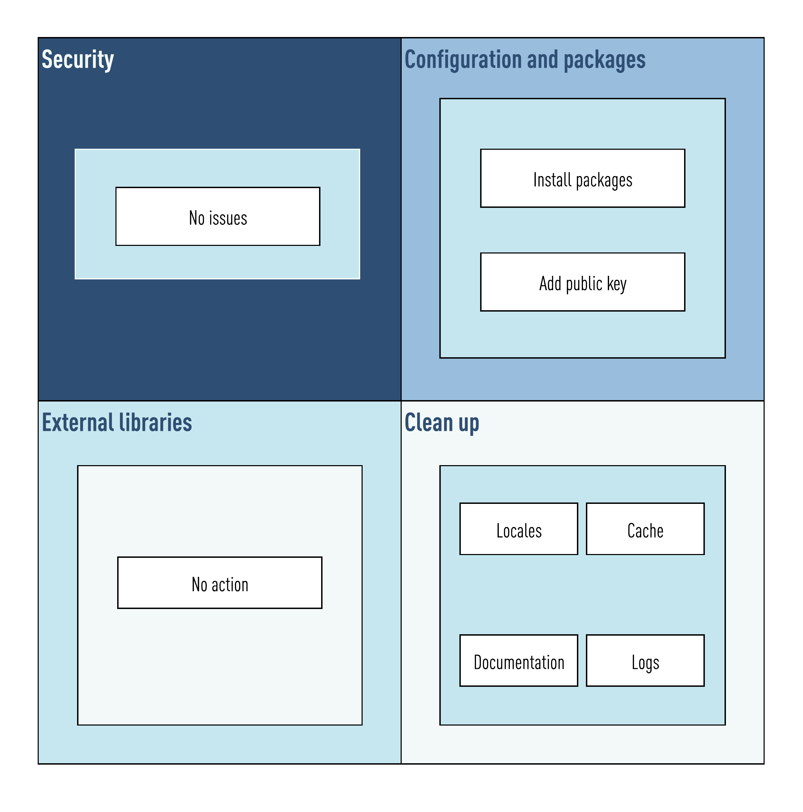
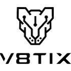

# Welcome

 

Welcome to the Atrous project. This image is part of the [k8sb](https://github.com/v8tix/k8sb) project.

#### Prerequisites
* Docker Engine installed.

## What this guide covers
1. The Atrous image contexts.
2. Common operations.
### 1. The Atrous image contexts.
* The following figure shows these contexts:

* In this case Atrous uses three contexts: 
  * Configuration and packages: 
    * In this context Atrous adds a public key.
  * Security. 
    * SUID and SGID permissions removed from applications.    
  * Clean up. 
    * Deleted: documentation, cache, and logs generated in the Configuration and packages context.      
### 2. Common operations.
* At the root directory you will find the following directories.
  * configuration:
    * Here you can change the image name and its tag. 
  * build.
    * The Docker file, and the container artifacts need must be included here.
    * Also in this directory you can find the build.sh script. Execute it if you plan to build this image. 
    * Once the image was build, you can go to the executables directory.
  * executables.
    * Each script under this directory wraps a useful Docker command.
    * To give a try the container:
      * Execute the run.sh script. This will start a detached container.
      * To get a console, execute the attach.sh script.
      * :bulb: Like in SSH connections, type 'exit' and then press Enter to close the console.
      * When you are done, there are two ways to stop it:
        * If you want to stop it, and keep this image, execute the stop.sh script,         
        * Otherwise execute the delete.sh script instead.
## Authors
* Initial work

 
&nbsp;&nbsp;&nbsp;&nbsp;&nbsp;&nbsp;&nbsp;[Contact us](mailto:info@v8tix.com)

## License  
<a rel="license" href="http://creativecommons.org/licenses/by/4.0/">&nbsp;</a>This work is licensed under a [Creative Commons Attribution 4.0 International License](http://creativecommons.org/licenses/by/4.0/).  
  

 